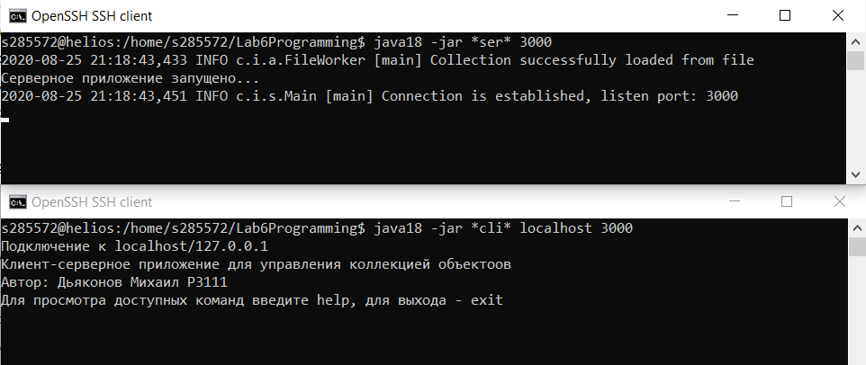

# Lab6ClientServer
Laboratory work 6, ITMO Programming

#### Task

**Необходимо выполнить следующие требования:**
- Операции обработки объектов коллекции должны быть реализованы с помощью _Stream API_ с использованием лямбда-выражений.
- Объекты между клиентом и сервером должны передаваться в сериализованном виде.
- Объекты в коллекции, передаваемой клиенту, должны быть отсортированы по названию
- Клиент должен корректно обрабатывать временную недоступность сервера.
- Обмен данными между клиентом и сервером должен осуществляться по протоколу _UDP_
- Для обмена данными на сервере необходимо использовать _датаграммы_
- Для обмена данными на клиенте необходимо использовать _сетевой канал_
- Сетевые каналы должны использоваться в неблокирующем режиме.

**Обязанности серверного приложения:**
- Работа с файлом, хранящим коллекцию.
- Управление коллекцией объектов.
- Назначение автоматически генерируемых полей объектов в коллекции.
- Ожидание подключений и запросов от клиента.
- Обработка полученных запросов (команд).

**Серверное приложение должно состоять из следующих модулей (реализованных в виде одного или нескольких классов):**
- Модуль приёма подключений.
- Модуль чтения запроса.
- Модуль обработки полученных команд.
- Модуль отправки ответов клиенту.

**Сервер должен работать в _однопоточном_ режиме.**

**Обязанности клиентского приложения:**
- Чтение команд из консоли.
- Валидация вводимых данных.
- Сериализация введённой команды и её аргументов.
- Отправка полученной команды и её аргументов на сервер.
- Обработка ответа от сервера (вывод результата исполнения команды в консоль).
- Команду _save_ из клиентского приложения необходимо убрать.
- Команда _exit_ завершает работу клиентского приложения.

**Дополнительное задание:**
- Реализовать логирование различных этапов работы сервера (начало работы, получение нового подключения, получение нового запроса, отправка ответа и т.п.) с помощью _Log4J2_

**Result**

**Acquired skills:**
- TCP and UDP protocols
- Blocking and Non-blocking i/o
- Serialization
- Java Stream API

